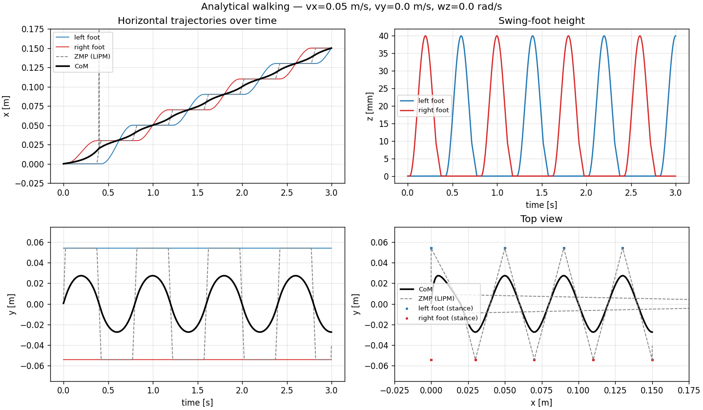

# humanoidMotion-predictiveControl

[](https://github.com/PedroH-Peres/humanoidMotion-predictiveControl/actions/workflows/tests.yml)
[](LICENSE)

Simulações de caminhada bípede para robôs humanoides, feitas para estudo: **Pêndulo Invertido Linear (LIPM)**, **ZMP**, **controle preditivo (MPC)** e **cinemática inversa analítica**, em código curto e comentado.

| Simulação | Robô | Gerador de caminhada | Simulador |
|-----------|------|----------------------|-----------|
| [`mujoco_sim/`](mujoco_sim/) | Robotis OP3 (modelo oficial) | Analítico (LIPM em forma fechada) | MuJoCo |
| [`pybullet_sim/`](pybullet_sim/) | Aurea (URDF próprio) | MPC do CoM (QP com restrição de ZMP) | PyBullet |



> 📖 **Teoria:** [`docs/theory.md`](docs/theory.md) explica cada modelo e aponta onde ele está no código.

<details>
<summary><b>English summary</b></summary>

Bipedal walking simulations built for learning: Linear Inverted Pendulum (LIPM), ZMP, model predictive control (MPC) and analytical inverse kinematics, in short, commented Python.

- `mujoco_sim/`: Robotis OP3 in MuJoCo with an analytical LIPM walking pattern generator and 6-DoF analytical leg IK. Run `python -m mujoco_sim` and drive it with the arrow keys.
- `pybullet_sim/`: custom Aurea robot in PyBullet with a CoM planner based on a ZMP-constrained MPC (cvxpy + OSQP). Run `python pybullet_sim/main.py`.
- `docs/theory.md` (Portuguese) derives every model and links each equation to the code. Code and comments are in English.

</details>

---

## Instalação

Requer Python 3.10+. As duas simulações são independentes; instale só o que for usar:

```bash
git clone https://github.com/PedroH-Peres/humanoidMotion-predictiveControl.git
cd humanoidMotion-predictiveControl
python -m venv .venv && source .venv/bin/activate   # Windows: .venv\Scripts\activate

pip install -e ".[mujoco]"      # simulação MuJoCo
pip install -e ".[pybullet]"    # simulação PyBullet
pip install -e ".[tools,dev]"   # gráficos e testes
```

---

## mujoco_sim: OP3 com caminhada analítica

Física completa (contato, gravidade, atuadores PD) com o modelo oficial do Robotis OP3. O `robot_descriptions` baixa o MJCF automaticamente na primeira execução.

```bash
python -m mujoco_sim          # da raiz do repositório
```

> No **macOS**, o viewer passivo do MuJoCo precisa ser iniciado com `mjpython -m mujoco_sim`.

Com a **janela do viewer em foco**:

| Tecla | Comando |
|-------|---------|
| `↑` / `↓` | Andar para frente / para trás |
| `←` / `→` | Passo lateral para a esquerda / direita |
| `PgUp` / `PgDn` | Girar para a esquerda / direita |
| `Home` | Marchar no lugar |
| `Delete` | Parar (termina o passo atual) |

Todas as letras já são atalhos do viewer do MuJoCo (wireframe, sombras, contatos…), por isso os comandos ficam nas setas e nas teclas de navegação. Para sair, feche a janela.

### Configuração

Tudo em [`mujoco_sim/config.py`](mujoco_sim/config.py):

| Parâmetro | Efeito |
|-----------|--------|
| `PHYSICS` | `True`: `mj_step` com física real. `False`: só cinemática (útil para depurar o gerador e o IK) |
| `WALK_PARAMS` | Período do passo `T`, altura do torso `z_com`, altura do pé `z_step`, fração de apoio duplo `ds_ratio`, separação dos pés `y_sep` |
| `KEY_COMMANDS` | Velocidades associadas às teclas |
| `ACTUATOR_KP/KV/FORCE_RANGE` | Ganhos e limite de torque dos atuadores |

### Código

```
mujoco_sim/
├── sim.py                        # modelo MuJoCo, laço de simulação, teclado
├── config.py                     # todos os parâmetros
├── analytical_walking/
│   ├── trajectory_generator.py   # LIPM em forma fechada, pé em balanço, planejamento de passos
│   └── walking_engine.py         # máquina de estados da caminhada
└── kinematics/
    └── ik_solver.py              # IK analítica 6-DoF da perna do OP3
```

---

## pybullet_sim: Aurea com MPC

O CoM é planejado por um MPC que resolve dois QPs (eixos x e y) a cada 20 ms (LIPM discretizado + ZMP dentro do pé). A IK é relativa ao torso: os pés são posicionados no referencial do corpo, não do mundo.

```bash
python pybullet_sim/main.py                          # GUI, 0,1 m/s
python pybullet_sim/main.py --vx 0.05                # outra velocidade
python pybullet_sim/main.py --headless --duration 10 # sem GUI
```

O robô passa por uma pose inicial de estabilização e depois começa a andar.

```
pybullet_sim/
├── main.py           # laço de simulação, MPC → IK → motores
├── mpc_planner.py    # QP do MPC (cvxpy/OSQP) e plano de passos
├── kinematics.py     # IK analítica relativa ao torso
└── assets/aurea/     # URDF, meshes e export do SolidWorks
```

> ⚠️ O MPC roda em **malha aberta** e há um descompasso conhecido entre o relógio do MPC e o da física. Veja [Limitações conhecidas](docs/theory.md#limitações-conhecidas).

---

## Ferramentas e testes

```bash
python tools/plot_trajectories.py --vx 0.05      # CoM, ZMP e pés do gerador analítico
python tools/plot_trajectories.py --vy 0.03 --vx 0 --save lateral.png
python tools/inspect_urdf.py                     # juntas e offsets do URDF do Aurea

pytest                    # todos os testes
pytest -m "not slow"      # pula as simulações físicas completas
```

Os testes conferem propriedades da trajetória (continuidade, pé nunca abaixo do chão, condições de contorno do LIPM), o IK contra a cinemática direta do MuJoCo, as restrições do MPC e uma caminhada completa sem queda. Eles rodam no GitHub Actions a cada push.

---

## Créditos

- O gerador de trajetória analítico é um port em Python do `trajectory_generator.cpp` do pacote ROS2 **aurea_walk**, com duas correções no perfil de pouso do pé (veja os comentários no código).
- Modelo do OP3: [MuJoCo Menagerie](https://github.com/google-deepmind/mujoco_menagerie/tree/main/robotis_op3), via [robot_descriptions](https://github.com/robot-descriptions/robot_descriptions.py).

## Licença

[MIT](LICENSE). Use, modifique e redistribua à vontade, mantendo o aviso de copyright.
